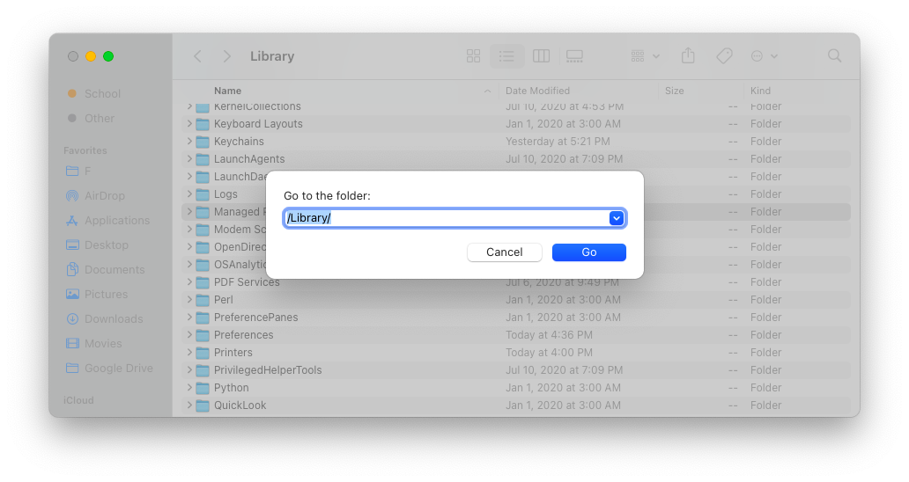

# Unconfirmed MDM Removal Steps
###### Personal Use Only
--

## 0.1
Locate the following folder  and delete folder "<b>Managed Preferences</b>".

## 0.2
Locate the following folder  and delete folder "<b>ConfigurationProfiles</b>".

## 0.3
Locate the following folder  and delete file "<b>apsd.keychain</b>".

## 0.4
Reboot and run the following command in terminal:  

Let me know if it worked for you 😄
<small><pre>Written by Rohin</pre></small>